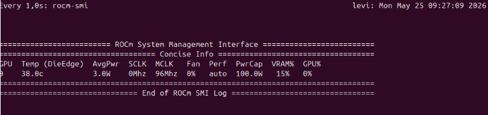
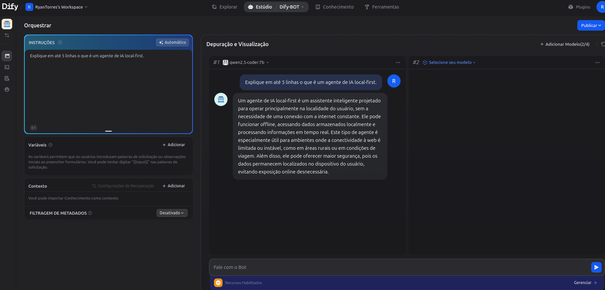
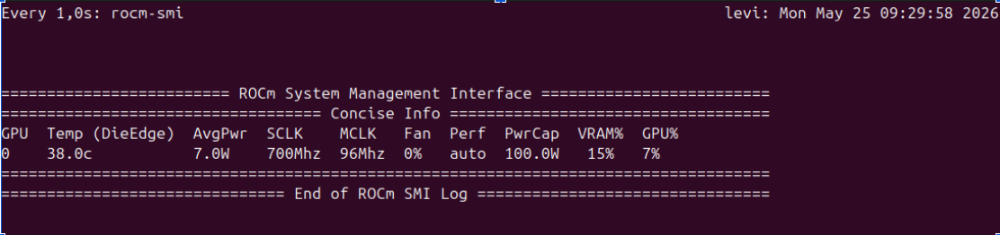

## 1. Teste Inicial: Chatbot Local (Qwen 2.5)

Para validar a integração e o uso do hardware, foi criado um Chatbot simples no Dify consumindo o modelo `qwen2.5-coder:7b` via Ollama.

**Configuração do App:**
* **Tipo:** Chatbot
* **Nome:** Teste Local Ollama
* **Modelo:** qwen2.5-coder:7b
* **Prompt Testado:** "Explique em até 5 linhas o que é um agente de IA local-first."

**Monitoramento de VRAM (Antes da Inferência):**

**Resultado no Dify:**

**Monitoramento de VRAM (Durante/Depois da Inferência):**

**Critérios de Sucesso Atingidos:**
* [x] O Dify respondeu usando apenas o Ollama (sem APIs externas).
* [x] O monitoramento comprovou o uso da GPU local (AMD RX 6600) para processar o LLM.
* [x] A resposta respeitou o limite do prompt e apareceu na interface web.